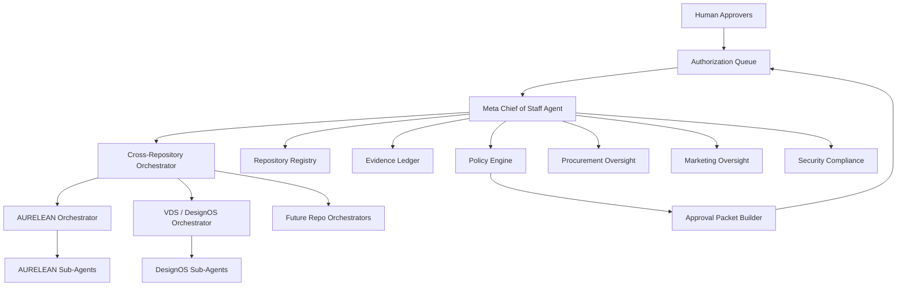

# Architecture: Meta Chief of Staff Agent

## 1. Architectural Intent

The system is a **portfolio control plane**. It sits above repository-level orchestrators and below human executives/approvers. It coordinates work, but it does not own project-specific product behavior. Project-specific product behavior remains inside each repository through project-level orchestrators and sub-agents.

## 2. Logical Architecture

```txt
Human Principal / Approvers
        │
        ▼
Authorization Console / Approval Queue
        │
        ▼
Meta Chief of Staff Agent
        │
        ├── Policy Engine
        ├── Repository Registry
        ├── Project Health Synthesizer
        ├── Approval Packet Builder
        ├── Evidence Ledger Adapter
        ├── Cross-Repository Orchestrator
        ├── Procurement Oversight Agent
        ├── Marketing Oversight Agent
        ├── Finance Ops Agent
        ├── Security Compliance Agent
        └── Audit Evidence Agent
        │
        ▼
Repository-Level Orchestrators
        │
        ├── AURELEAN Orchestrator / Codex Orchestrator
        ├── VDS / DesignOS Orchestrator
        └── Future project orchestrators discovered from other repos
        │
        ▼
Project-Level Specialist Sub-Agents
```

## 3. Control Boundary

The Meta Agent may control **routing, planning, observation, prioritization, risk classification, and approval packet creation**. It may not control approval decisions. Any high-risk or critical execution requires a human approver.

## 4. System Components

### 4.1 Meta Chief of Staff Agent

Responsibilities:

- Accept portfolio-level goals.
- Decompose goals into project-level task packets.
- Select target repository orchestrators.
- Check risk and authorization policy before routing.
- Consolidate project health reports.
- Maintain approval queue.
- Produce executive synthesis.

### 4.2 Repository Registry

The registry is the source of truth for known repositories, known orchestrators, discovery status, and next inventory actions. It starts as `registries/repositories.seed.json` and can later be backed by a database.

### 4.3 Policy Engine

The policy engine classifies actions by risk and required approvals. It is deterministic and should run before any tool call that can mutate state, spend money, send messages, or access sensitive data.

### 4.4 Approval Packet Builder

The approval packet builder creates a structured decision object for humans. It must include:

- action summary
- affected repositories
- requested authority
- risk level
- approver roles
- evidence bundle
- rollback plan
- expiry
- decision options

### 4.5 Cross-Repository Orchestrator

This component does not perform specialist work. It coordinates repository discovery and routes task packets to local orchestrators.

### 4.6 Evidence Ledger

The evidence ledger should be append-only. For MVP, evidence is represented as JSON objects. Later versions should use a database table with immutable event IDs and content hashes.

### 4.7 Approval Console

The future UI should show:

- pending approvals
- project health cards
- blocked projects
- risk distribution
- launch readiness
- procurement queue
- marketing queue
- audit feed

## 5. Data Flow

### 5.1 Portfolio Goal Intake

```txt
User goal
  -> Meta Chief of Staff Agent
  -> policy pre-check
  -> task decomposition
  -> repo selection
  -> task packet generation
```

### 5.2 Repository Delegation

```txt
Task packet
  -> repository orchestrator
  -> project sub-agent routing
  -> repository validation
  -> orchestrator response
  -> Meta Chief synthesis
```

### 5.3 Human Approval

```txt
High/critical action
  -> policy engine detects gate
  -> approval packet builder
  -> human approver decision
  -> approved/rejected constraints recorded
  -> run resumes or stops
```

### 5.4 Evidence Flow

```txt
Run start
  -> task packet ID
  -> orchestrator response
  -> validation output
  -> approval packet if needed
  -> decision record
  -> final synthesis
  -> evidence ledger hash
```

## 6. Integration Strategy

### GitHub

Initial mode: read-only discovery.

Future approved mode:

- create issues from task packets
- open PRs with generated design documents
- comment approval packet summaries
- read CI status
- link evidence to commit SHA

### OpenAI Agents SDK / Agent Runtime

Future runtime should use:

- agents configured with instructions, models, and tools
- handoffs to specialist agents
- tool guardrails around every mutation-capable tool
- tracing for model generations, tool calls, handoffs, guardrails, and custom events
- human-in-the-loop interruption/resume behavior for approvals

### Supabase / Database

Future storage:

- repositories
- project_health_snapshots
- task_packets
- approval_packets
- approval_decisions
- evidence_events
- agent_runs
- policy_versions

### Marketing Systems

Potential integrations:

- CRM lead stages
- campaign calendars
- UTM generator
- attribution events
- public content review queue

No public send or spend action should execute without approval.

### Procurement / Finance Systems

Potential integrations:

- vendor registry
- purchase request queue
- budget thresholds
- contract review
- invoice/payment handoff

No vendor award, contract, or spend action should execute without approval.

## 7. Security Model

- Read-only by default.
- No secret access.
- No autonomous production mutation.
- Tool-level approval required for write, deploy, billing, spend, public send, data export, and regulated-domain actions.
- Every high-risk action must carry a rollback plan.
- Policy failure means action is blocked.

## 8. Memory Model

### Portfolio Memory

Can store repository inventory, project status, milestones, blockers, and approval history.

### Project Memory

Should stay inside the project repository and its own agent system. The Meta Agent may read project memory summaries if authorized but should not rewrite project policy directly.

### Sensitive Memory

PII, customer/supplier confidential data, secrets, financial account data, and contract contents require explicit access policy. Default behavior is metadata-only.

## 9. Deployment Modes

### Mode 0: Local Design Package

Markdown docs, JSON schemas, deterministic JS scaffold.

### Mode 1: Read-Only Portfolio Scanner

Can inspect repositories and generate health snapshots.

### Mode 2: Approval Queue

Can generate human approval packets and record decisions.

### Mode 3: Controlled GitHub Routing

Can create GitHub issues/PRs only after approval.

### Mode 4: Operational Control Plane

Can coordinate cross-project milestones, dashboards, procurement/marketing reviews, and CI/evidence flows with strict authorization.

## 10. Mermaid Overview


